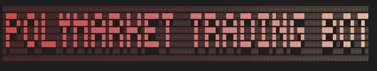

# Polymarket Trading Bot — Claude Skills MVP

AI-powered prediction market trading bot for Polymarket. Five-stage Claude-Skills pipeline orchestrated by an asyncio daemon. **Paper trading only** in v1; live trading remains intentionally unreachable in code.

## Pipeline

```
Scan → Research → Predict → Risk/Execute → Compound
```

Each stage is a Claude Skill (`.claude/skills/<name>/SKILL.md`). Strategy lives in markdown; deterministic math lives in `scripts/*.py`.

## Quick start

```bash
uv venv --python /Users/roger/.pyenv/versions/3.12.2/bin/python .venv
source .venv/bin/activate
uv pip install --python .venv/bin/python -e '.[dev]'
cp .env.example .env  # fill in keys
pytest                # run unit tests
python -m bot.daemon --once --paper --mock-ai --max-markets 1  # local smoke test
python -m bot.daemon --once --paper --scan-only --max-markets 10  # live-data scan
python -m bot.daemon --paper         # always-on paper trading
scripts/paper-daemon start           # tmux paper-run harness
```

## Layout

- `src/bot/` — daemon, orchestrator, Polymarket client, Claude client, paper simulator, storage, metrics
- `.claude/skills/` — five skills (`pm-scan`, `pm-research`, `pm-predict`, `pm-risk`, `pm-compound`)
- `tests/` — unit tests for deterministic logic (Kelly, risk, simulator, metrics)
- `data/` — SQLite DB and `STOP` kill-switch sentinel

## Kill switch

```bash
scripts/paper-daemon stop
```

Daemon halts new signals within 60s.

See `docs/RUNBOOK.md` for tmux startup, monitoring, logs, status checks, and shutdown.

## Going live

Do not enable live trading in v1. `RuntimeSettings.live_trading_enabled` forces `False` even if `LIVE_TRADING=true` is present.
